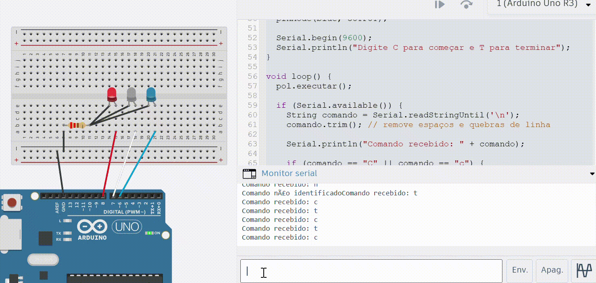

# Atividade em Sala: Sistema de Luzes de Polícia com POO

## 📘 Descrição da Atividade

Nesta atividade, o objetivo foi **utilizar Programação Orientada a Objetos (POO)** para criar um **sistema de luzes de polícia** no Arduino, utilizando **três LEDs** (vermelho, branco e azul), além de **monitor serial** e **protoboard** no **Tinkercad**, totalizando **cinco elementos** no circuito, que era o mínimo necessário.

A simulação permite **controlar o piscar das luzes** através de comandos “C” (começar) e “T” (terminar), enviados pelo monitor serial.

---

## ⚙️ Etapas Realizadas

### 1. Código Fonte Utilizado

O código foi desenvolvido usando uma classe chamada `Policia`, que encapsula o comportamento dos LEDs e os métodos necessários para iniciar, parar e executar o padrão de piscamento.

Pode ser verificado em [policia.ino](policia.ino)

---

### 2. Explicação do Funcionamento

- Os **pinos 6, 7 e 8** foram atribuídos aos LEDs azul, branco e vermelho, respectivamente.  
- A **classe `Policia`** organiza o controle dos LEDs, tornando o código mais modular.  
- A função `executar()` é chamada em loop, piscando as luzes enquanto o sistema estiver ativo.
- O **monitor serial** é usado para enviar comandos:
  - **C** → inicia o piscar das luzes;
  - **T** → interrompe a execução e apaga todas as luzes.

---

### 3. Evidências de Execução

#### 🎥 Vídeo

A seguir, o vídeo demonstra o funcionamento real do sistema desenvolvido:

*GIF 1 - Sistema de luzes em funcionamento*

 

Fonte: Maria Eduarda, 2025

---

### 4. Link TinkerCad

O projeto foi simulado no Tinkercad, onde é possível visualizar as conexões com:
- Arduino UNO  
- Protoboard  
- 3 LEDs (vermelho, branco e azul)  
- Jumpers e resistores

[Link para o TinkerCad](https://www.tinkercad.com/things/lfhua6YK8Dk-mighty-gaaris-lahdi/editel?returnTo=https%3A%2F%2Fwww.tinkercad.com%2Fdashboard%2Fdesigns%2Fcircuits&sharecode=a0USIFMZ7VSIamG_pRQ8w2JY8RHThCtL8L8U5wRXDp0)

#### 💡 Arduino em Funcionamento

*GIF 1 - Luzes de polícia piscando virtualmente*

 

Fonte: Maria Eduarda, 2025

---
