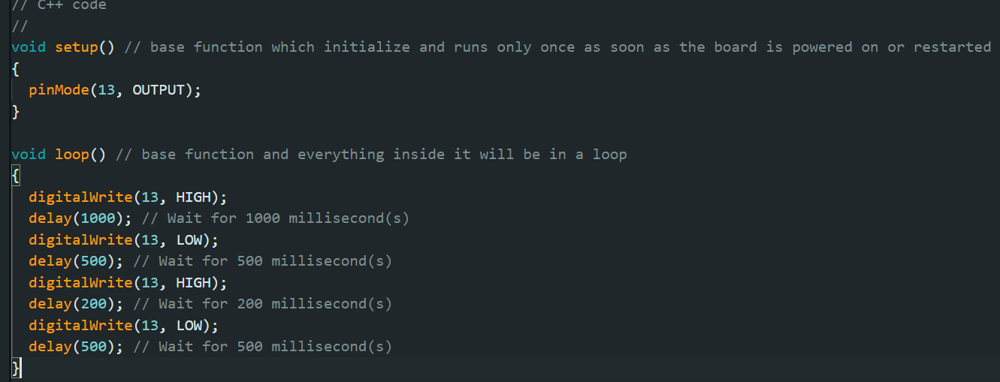
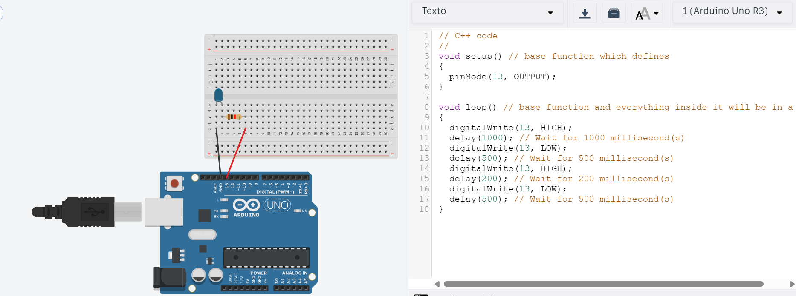

# Ponderada - Parte 1: Blink LED Interno

## 📘 Descrição da Atividade

Esta atividade deve ser realizada **antes da instrução de programação**.  
O objetivo é **fazer o LED interno do Arduino piscar** com intervalos definidos entre os estados de ligado e desligado, criando o efeito de um “pisca-pisca”.

---

## ⚙️ Etapas Realizadas

### 1. Código Fonte Utilizado

O código apresenta duas funções básicas:
`void setup()` onde inicializa o bloco quando a protoboard é ligada
`void loop()` onde se enconta um código que rodará em loop

O código faz com que a luz colocada no arduíno fique piscando nos intervalos definidos, e isso acontece em loop, após o código ser colocado no arduíno uno.

### 3. Evidências de Execução

#### 🎥 Vídeo

Pode ser verificado o funcionamento real em [video_demo.mp4](video_demo.mp4).

#### 📸 Capturas de Tela do IDE

O código para que o arduíno possa funcionar apresentado na imagem abaixo:

*IMAGEM 1 - Código de arduíno*

 

Fonte: Maria Eduarda, 2025

 

#### 🖥️ Upload do Código

Pode ser verificado em [sketch_led.ino](sketch_led.ino)

---

### 4. Link TinkerCad

Foi feita também uma simulação do mesmo projeto através da plataforma em questão, que apresenta o funcionamento, as ligações com jumpers, com a luz de led, com o resistor, com o arduíno UNO, bem como com a protoboard, e para finalizar, com o código ao lado para verificação.

Basta acessar o link e rodar o código.

[Link para o Tinker cad](https://www.tinkercad.com/things/2CwPfL7w5w7/editel?sharecode=GUAnrf8etMOiYJgj0JWL9KvD2pxvQmCJmym353uxdC8)

#### 💡 Arduino em Funcionamento

A imagem e gif abaixo apresentam o funcioanmento do arduíno no simulador virtual, hospedado no link acima.

*IMAGEM 2 - Código de arduíno virtual*

 

Fonte: Maria Eduarda, 2025

 

*GIF 1 - Arduíno virtual em funcionamento*

 

Fonte: Maria Eduarda, 2025

 

---
